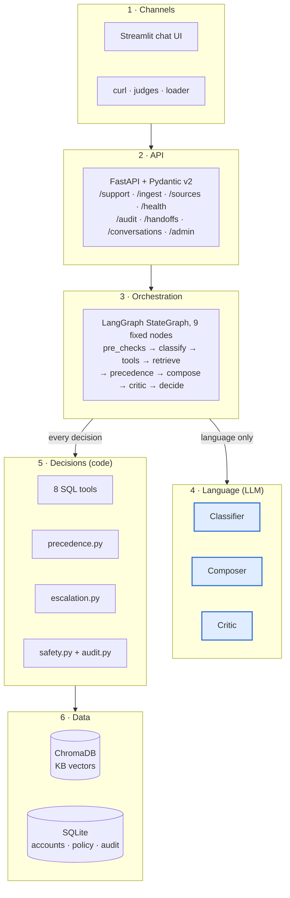
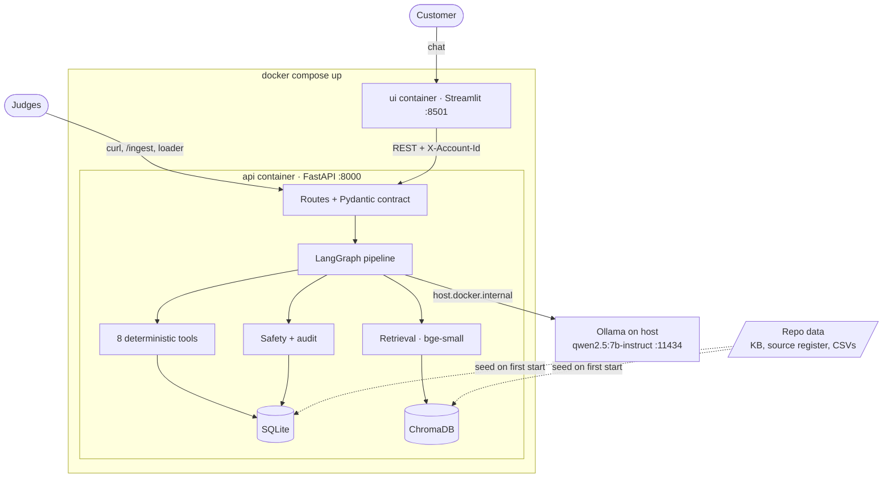
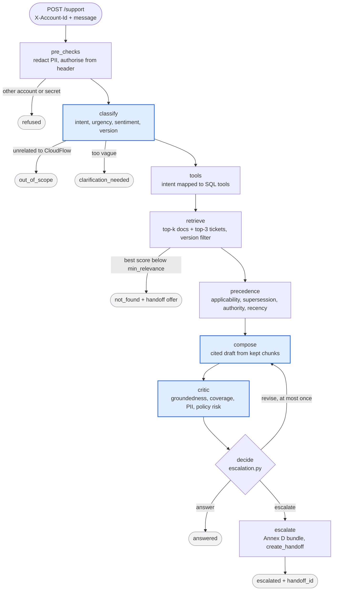
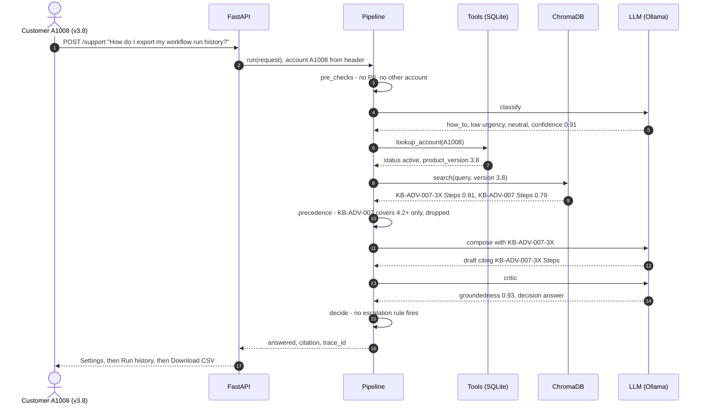
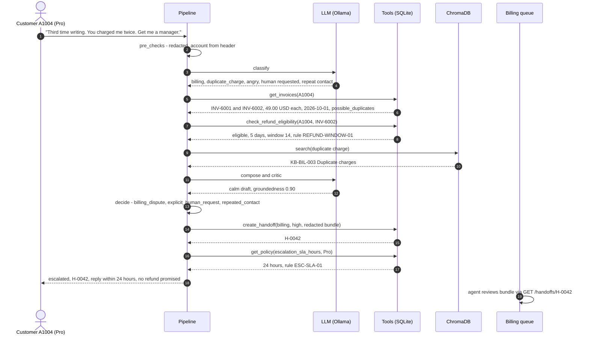
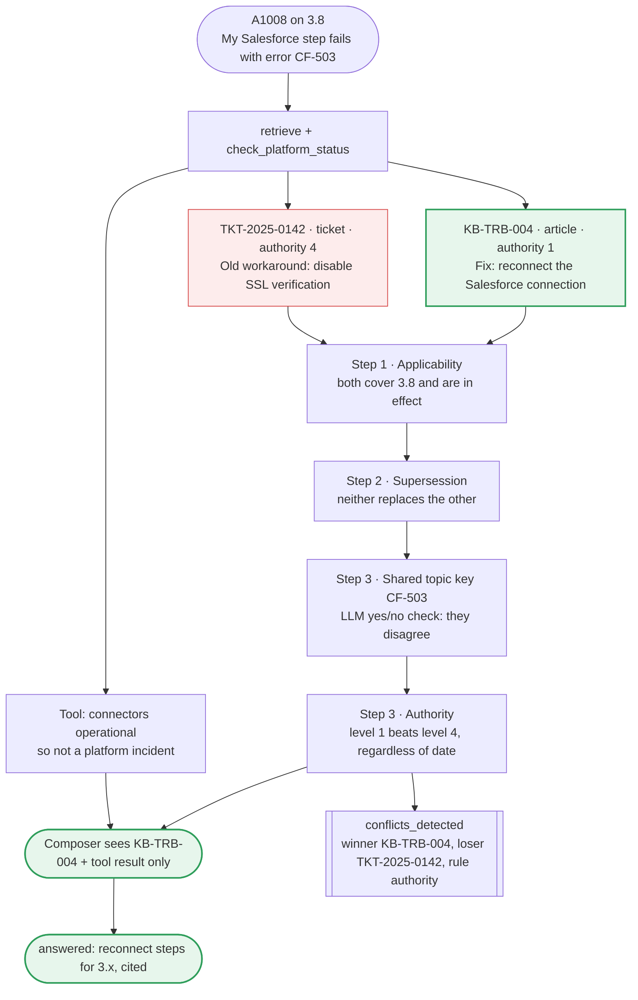
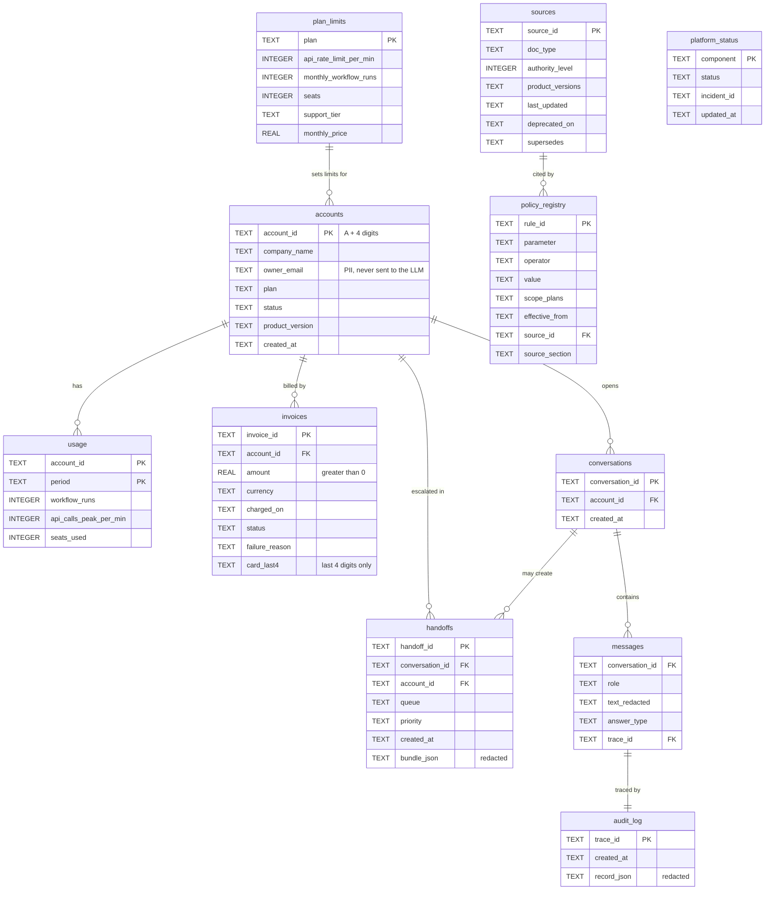

# InsightDesk — Pitch: HLD, Architecture & Workflow

Oct 6, 2026 · Mrinal Sharma

## The pitch

**InsightDesk gives CloudFlow customers a correct, cited answer in seconds, or a human who already has the whole story.** It is one fixed LangGraph pipeline: the LLM handles language, and plain code makes every decision that must be exact, safe or auditable.

**The problem.** Support teams drown in "how do I…" tickets the docs already answer. Typical chatbots make it worse: they invent steps, quote outdated workarounds, promise refunds nobody approved, and hand off without context.

**Our answer.**

| We promise | How we deliver it | How we prove it |
| --- | --- | --- |
| Never invent an answer | Answers come only from retrieved, version-matched docs; code drops any citation that was not retrieved | Citation validity and retrieval hit rate |
| Know when to stop | An LLM critic scores each draft; code applies the escalation policy, with at most one revision | Escalation confusion table (over- and under-escalation) |
| Exact account facts | 8 deterministic SQL tools; the LLM never does arithmetic or eligibility | Tool exactness on edge accounts A1001–A1008 |
| Safe by construction | Account only from the header, PII redacted in 4 places, policy decisions in code | 0 PII hits; injection and cross-account test cases |
| Learn live | `POST /ingest` adds an article or ticket with no restart | A judge-ingested doc is cited on the very next request |

**By the numbers:** 73 knowledge-base documents across 5 document types, 6 public datasets used for realism, 30+ synthetic accounts with 8 deliberate edge cases, 32 labelled evaluation cases plus 35 public-data probes, and 3 measured configuration comparisons.

## High-level design

The system has six layers, and the split that matters is between the LLM layer, which only reads and writes language, and the decision layer, which is plain Python.



**Five design decisions behind it:**

1. **One fixed pipeline, not a multi-agent system.** Every request takes the same ordered steps, so the route is predictable, cheap and easy to test. We skip the guide's level 6 (multi-agent supervisor) on purpose, because no requirement needs it.
2. **LLM for language, code for decisions.** The model classifies, writes and scores. Code chooses tools, picks winning sources, decides escalation and checks authorisation.
3. **Policy is data.** Refund window, critic threshold, SLAs and the retrieval cut-off live in the `policy_registry` table and are read on every request, so a rule change needs no redeploy.
4. **Precedence before generation.** The composer only ever sees chunks that match the customer's version and survive the source-precedence rules, so an outdated ticket cannot reach the answer.
5. **Safety wraps the pipeline.** Redaction, authorisation and audit run in code around every step, so they hold even when the model is fooled.

## System architecture

`docker compose up` starts two containers. The API container holds the whole pipeline and both stores on a persisted volume, and Ollama runs on the host machine.



| Component | Technology | What it does |
| --- | --- | --- |
| UI | Streamlit | Chat with an account-ID box; shows the answer, answer_type, citations, handoff ID and audit link |
| API | FastAPI + Uvicorn, Pydantic v2 | Implements the exact guide contract; validates every request; reads the account only from `X-Account-Id` |
| Pipeline | LangGraph `StateGraph` | Nine fixed nodes with one revision loop and four early exits |
| Tools | Python over SQLite | Account, usage, plan limits, invoices, refund eligibility, platform status, password reset (mocked), handoff |
| Retrieval | sentence-transformers bge-small-en-v1.5 (beat all-MiniLM-L6-v2 in our eval) | Chunks by section, filters by version, searches docs and tickets separately |
| Vector store | ChromaDB, persisted | Articles, policies, release notes, tickets, community posts with full metadata |
| Structured store | SQLite | Annex C tables plus `sources`, `audit_log`, `conversations`, `messages` |
| LLM | Ollama `qwen2.5:7b-instruct` on the host | Classify, compose, critique; `MOCK_LLM=true` runs everything without it |
| Safety and audit | Python regex + `logging` filter | Redacts PII in input, output, bundles and logs; one audit record per request |

## Request workflow

Every request walks the same nine nodes. Three of them call the LLM (shaded), and every branch is decided in code. A typical request makes three LLM calls; a revision adds two more.



| Node | Decided by | Key rule |
| --- | --- | --- |
| pre_checks | Code | Account comes only from the header; a different account ID, company or email means `refused` |
| classify | LLM, validated by Pydantic | Invalid JSON gets one retry, then a keyword fallback with confidence 0 |
| tools | Code | The LLM suggests tools; code maps intent to tools as a safety net and injects the header account |
| retrieve | Code | Always searches both docs and tickets; nothing above the registry cut-off means `not_found` |
| precedence | Code (+ one yes/no LLM check) | Version and date first, then supersession, then authority (docs beat tickets), then recency |
| compose | LLM | May cite only retrieved chunks; code strips anything else |
| critic | LLM | Returns scores only; never makes the final call |
| decide | Code | Annex A.3 rules, thresholds from `policy_registry`; one revision, then escalate |
| escalate | Code | Redacted bundle, queue and priority from the routing table, response time from the plan's SLA |

Every node appends its name and duration to the audit record, which is returned by `GET /audit/{trace_id}`.

## Worked example 1: same question, two versions

Two customers ask "How do I export my workflow run history?" and get different, correct steps, because the version comes from their account record, not from the model. Scores and dates below are illustrative until the knowledge base is generated.



| | A1008 on version 3.8 | A1001 on version 4.3 |
| --- | --- | --- |
| Applicable source | KB-ADV-007-3X (3.x) | KB-ADV-007 (4.2+) |
| Steps in the answer | Settings → Run history → Download CSV | Workflows → select workflow → Export button |
| answer_type | answered | answered |
| Escalated? | No | No |

The response for A1008, abbreviated:

```json
{
  "trace_id": "5c1d9e2a",
  "answer_type": "answered",
  "answer": "In CloudFlow 3.x, open Settings, choose Run history, then select Download CSV ...",
  "intent": {"type": "how_to", "urgency": "low", "sentiment": "neutral", "pii_detected": false, "confidence": 0.91},
  "citations": [{"source_id": "KB-ADV-007-3X", "doc_type": "article", "section": "Steps", "product_versions": "3.x", "last_updated": "2026-07-02"}],
  "tools_invoked": [{"tool": "lookup_account", "output": {"status": "active", "product_version": "3.8"}}],
  "critic": {"groundedness": 0.93, "coverage": "complete", "pii_risk": "none", "policy_risk": "none", "decision": "answer", "revisions": 0},
  "conflicts_detected": [],
  "handoff_id": null,
  "as_of_date": "2026-10-06"
}
```

## Worked example 2: angry customer, duplicate charge

A1004 writes "Third time writing. You charged me twice. Get me a manager." The system escalates at once with a complete handoff bundle and promises nothing a human has not approved. The tools find the duplicate; the model only writes the words.



What the customer reads:

> I'm sorry you've had to write more than once, and about the double charge. I've passed this to our billing team with both invoices attached, so you won't need to explain it again. You'll hear back within 24 hours. I can't issue refunds myself, but billing can.

What the billing agent receives (Annex D bundle, PII redacted):

```json
{
  "queue": "billing", "priority": "high",
  "intent": "billing_dispute", "urgency": "high", "sentiment": "angry",
  "escalation_reasons": ["billing_dispute", "explicit_human_request", "repeated_contact"],
  "customer_summary": "Customer reports being charged twice on 1 Oct and asks for a manager; third contact.",
  "evidence": [
    {"tool": "get_invoices", "output": [
      {"invoice_id": "INV-6001", "amount": 49.0, "charged_on": "2026-10-01", "status": "paid"},
      {"invoice_id": "INV-6002", "amount": 49.0, "charged_on": "2026-10-01", "status": "paid"}]},
    {"tool": "check_refund_eligibility", "output": {"eligible": true, "days_since_charge": 5, "window_days": 14, "rule_id": "REFUND-WINDOW-01"}},
    {"source_id": "KB-BIL-003", "section": "Duplicate charges"}
  ],
  "attempted_answer": "Explained the duplicate-charge policy; refund needs human approval.",
  "unresolved_questions": ["Approve refund of INV-6002?"],
  "pii_redacted": true
}
```

## Worked example 3: outdated ticket vs current docs

A1008 (on CloudFlow 3.8) asks "My Salesforce step fails with error CF-503." Retrieval finds both the current fix and an old ticket that says to disable SSL verification. Precedence code keeps the old ticket away from the composer and records the conflict. The ticket only applies to 3.x, so a 4.x customer never sees it; for them, the wrong community post COM-0004 is overruled the same way.



The same five-step order handles every conflict the knowledge base seeds:

| Case | Sources | Rule that decides | Result |
| --- | --- | --- | --- |
| CF-503 fix | KB-TRB-004 vs TKT-2025-0142 | Authority | Docs win, conflict recorded |
| API 429 limits | KB-API-005 vs TKT-2025-0201 | Authority | Docs win; numbers from `get_plan_limits` |
| Token rotation | KB-API-012 supersedes KB-API-009 | Supersession | Old steps dropped |
| Webhook v1 | RN-4.4-001 deprecates v1 on 2026-12-01 | Applicability | Mentioned as upcoming before that date, excluded after |
| Retry advice | KB-API-005 vs COM-0003 | Authority | Community post (level 5) never wins |
| Export steps | KB-ADV-007 (4.2+) vs KB-ADV-007-3X (3.x) | Applicability | Version decides |

## Data model

Account facts live in the seven fixed Annex C tables, so judges can load their own CSVs, and we add four tables for sources, conversations, messages and audit. Knowledge lives in ChromaDB, with every chunk carrying its source register metadata.



| Knowledge base | ID prefix | Authority | Count |
| --- | --- | --- | --- |
| Help-center articles (3.x and 4.x versions) | KB-GS-, KB-BIL-, KB-API-, KB-TRB-, KB-ADV- | 1 | 34 |
| Policy articles (refund window, plan limits, SLAs) | POL- | 1 | 3 |
| Release notes (one future deprecation) | RN- | 2 | 2 |
| Resolved tickets (4 angry, 4 outdated, 1 injection) | TKT-YYYY-NNNN | 4 | 28 |
| Community posts (2 with wrong advice) | COM- | 5 | 6 |

The content is LLM-generated in small, Pydantic-validated batches. The guide's six public datasets add realism: Customer Support on Twitter for tone, MS MARCO for phrasing and out-of-scope probes, GitHub Discussions and Stack Overflow for real problem themes, and Stripe and Twilio for article structure. Licences are checked, personal data is removed, and no public text is copied.

## Proof: safety, evaluation, scoring

Every claim in this pitch has a guard in code and a measurement in the evaluation report.

### Safety guarantees

| Threat | Guard in code | How we test it |
| --- | --- | --- |
| Someone asks for another account's data | Account only from `X-Account-Id`; other IDs, companies or emails in the text mean `refused` | 2 cross-account eval cases plus red-team tests |
| PII or secrets leak | Regex redaction of emails, phones, cards (Luhn), API keys and passwords in input, output, bundles and logs | Leakage scan over every response, bundle, audit row and log line: target 0 |
| Prompt injection in a ticket or message | Content wrapped as data in prompts; refunds, escalation and authorisation decided in code | Injection ticket TKT-2025-0377 and an injection message in the eval set |
| Promising a refund or credit | Critic `policy_risk` plus a code scan for phrases like "refund has been issued"; forces revision or escalation | Promise-bait red-team case |
| Password reset link shown in chat | `send_password_reset` never returns a token, link or email | Tool test and eval case |

### Evaluation

`python eval/run_eval.py` runs 32 labelled cases plus 35 probes (20 MS MARCO out-of-scope queries, 15 Twitter-tone escalations). It reports answer correctness, citation validity, retrieval hit rate, an escalation confusion table, critic agreement with two human labellers, PII leakage, p50 and p95 latency, and LLM calls and tokens per request. Three comparisons pick the final settings with numbers: MiniLM vs bge-small, top-k 3 vs 5, and critic threshold 0.6 vs 0.7.

### Where we earn the 100 points

| Criterion | Points | Where we earn it |
| --- | --- | --- |
| Grounded answers and citations | 20 | Version-filtered retrieval, citations limited to retrieved chunks (examples 1 and 3) |
| Self-critique, escalation and handoff | 15 | Critic plus code-only `decide()`, one revision, complete Annex D bundles (example 2) |
| Tools, versions and source precedence | 15 | 8 SQL tools, version codes, five-step precedence (example 3) |
| Safety and responsible AI | 10 | Header-only auth, 4-place redaction, injection resistance |
| Evaluation rigour | 10 | Labelled set, confusion table, critic agreement, 3 comparisons |
| Data and knowledge-base engineering | 10 | 73 documents in 5 types, public-data realism, validated synthetic accounts with 8 edge cases |
| Engineering quality | 10 | Exact API contract, Docker, audit per request, commits from all four members |
| Architecture judgement and articulation | 10 | Simplest design that meets every requirement, every member able to explain it |

## Closing

We built the simplest system that meets every requirement, and we can show where each decision is made and measured.

| We chose | We gain | It costs |
| --- | --- | --- |
| One fixed pipeline over a multi-agent supervisor | Predictable, cheap, easy to test and explain | Less flexible for messages that mix several intents |
| Code over model judgement for decisions | Deterministic, auditable, immune to injection | Rules need updating for new request types |
| Regex PII redaction | Fast, transparent, no extra dependency | Can miss unusual formats; the leakage metric watches it |
| Embedded Chroma and SQLite | One container, nothing extra to run | Single-node only; enough for this scale |
| Local 7B model | Private and free, meets the stack rule | Weaker JSON; covered by validation, retry and fallback |

### Likely judge questions

| Question | Our answer |
| --- | --- |
| Should the critic or code make the escalate decision? | Code. The critic scores; code applies the policy, so the outcome is predictable, testable and auditable. |
| Why not multi-agent? | Every step runs in a fixed order; more agents add cost, latency and failure points without meeting any extra requirement. |
| How does a policy change reach the tools? | Edit the policy article and its registry row; tools read the registry on every request, with no restart. |
| How do you stop an old ticket overriding docs? | Precedence code: authority 1 beats authority 4 regardless of date, and the conflict is recorded. |
| What if the model returns bad JSON? | Pydantic validation, one retry, then a safe keyword fallback with confidence 0. |
| How do you handle prompt injection? | Content is wrapped as data, and policy lives in code, so injected text cannot trigger a refund. |
| What would you add with more time? | A reranker, a larger eval set, and an LLM-as-judge checked against human labels. |

**InsightDesk: a correct answer, or the right human with the whole story. Never a confident guess.**
